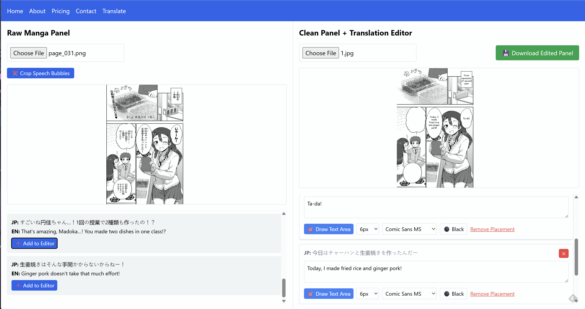

# TsengScans-AI-Manga-Translation-and-Writing-Tool
A web application that uses GPT-4 Vision to detect and translate Japanese text from manga panels, and allows users to
edit and place them onto clean manga panels.



## Features

- Upload manga panel images
- Automatic Japanese text detection and translation using GPT-4
- **Enhanced image processing** for better text recognition
- Interactive cropping tool for individual speech bubbles
- Clean web interface with React and Tailwind CSS
- Flask backend API

## Setup

### 1. Install Python Dependencies
```bash
# Basic dependencies
pip install flask flask-cors python-dotenv openai

# For enhanced image processing (recommended)
pip install Pillow numpy opencv-python
```

### 2. Set up API Key
Create an OpenAI API Key: https://platform.openai.com/api-keys

Go to the file named `api.env` in the project root and place your OpenAI API key here:
```
OPENAI_API_KEY=sk-your-api-key-here
```

### 3. Start the Flask Backend
```bash
python app.py
```
The backend will run on `http://localhost:5000`

### 4. Open the Frontend
Open `index.html` in your web browser, or serve it with a local server:
```bash
# Using Python
python -m http.server 8000

# Using Node.js (if you have it installed)
npx serve .
```

Then visit `http://localhost:8000`

## Usage

1. Open the web interface
2. Click "Choose File" to upload a manga panel image
3. Wait for GPT-4 to process the image and extract translations
4. View the Japanese text and English translations on the left side
5. **For better results with blurry text:**
   - Click "✂️ Crop Speech Bubbles" to enable cropping mode
   - Click and drag to select individual speech bubbles
   - The system will apply enhanced image processing (4x enlargement + contrast + sharpening)
   - This often provides much better text recognition for difficult-to-read text
6. The right side allows you to place translations on a clean manga panel

## Project Structure

```
manga_translator_project_2/
├── main.py              # Core GPT-4 translation logic
├── app.py               # Flask backend API
├── index.html           # React frontend
├── image_enhancer.py    # Enhanced image processing
├── requirements.txt     # Python dependencies
├── api.env              # OpenAI API key (create this)
├── panels/              # Input manga panels
├── output/              # Generated JSON files
└── README.md            # This file
```

## API Endpoints

- `POST /api/translate` - Upload image and get translations
- `GET /api/health` - Health check endpoint

## Cost Estimation

- Each image costs less than $0.01 (for 1024x1024 images)
- Costs vary based on image size and text length

## Troubleshooting

- Make sure your OpenAI API key is valid and has sufficient credits
- Check that the Flask backend is running on port 5000
- Ensure the image file is a valid image format (PNG, JPG, etc.) 
